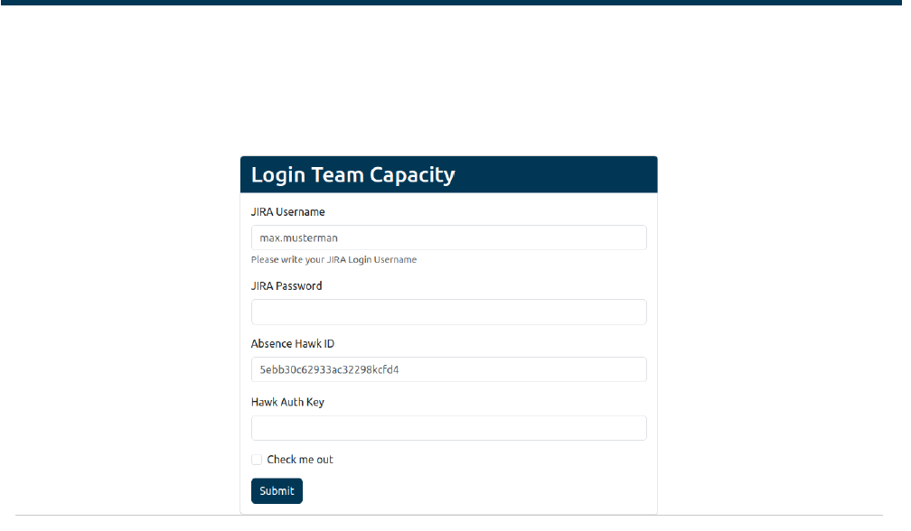
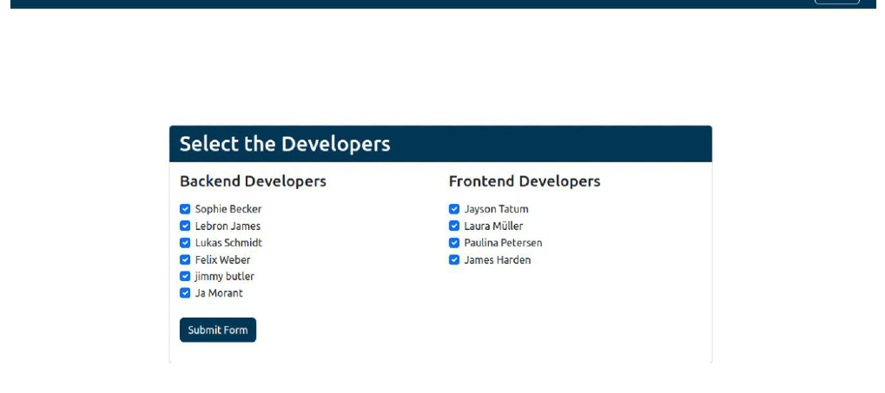
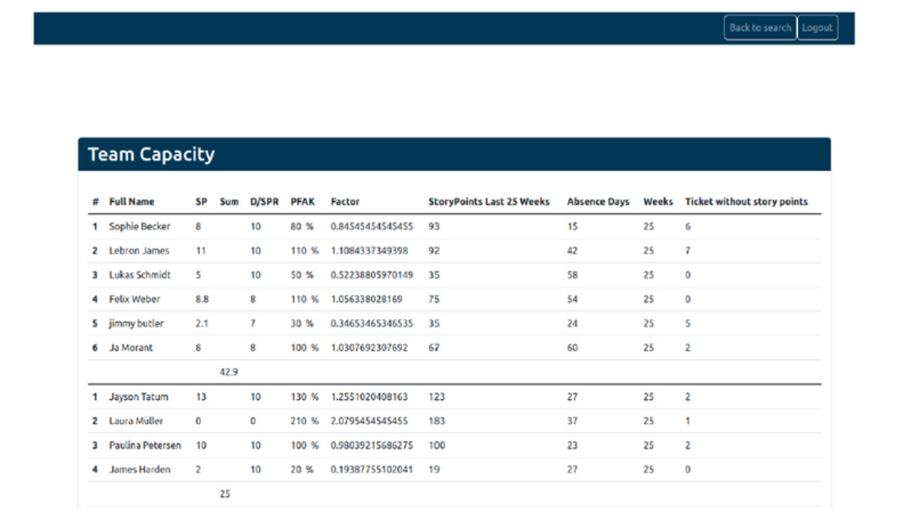

# Software zur Aufgabenverteilung in einem agilen Scrum-Team

## Introduction

Diese Software ermöglicht die Verteilung von Aufgaben innerhalb eines Teams, das das agile Scrum-Vorgehensmodell verfolgt.  
Die Zuweisungsentscheidungen basieren auf der Verfügbarkeit und der Leistung von dem Entwickler in den letzten sechs Monate .

Um die Anzahl der Aufgaben für jeden Entwickler während des kommenden Zyklus oder Sprint (zB. 2 Wochen) zu bestimmen, werden Daten von zwei REST-API-Schnittstellen abgerufen:

- Jira (ein Softwareentwicklungs-Management-System)
- Absence.io (eine webbasierte Softwarelösung zur Verwaltung von Abwesenheiten und Urlauben in Unternehmen)

Nach dem Abruf erfolgt eine automatische Analyse dieser Daten, und die ermittelten Ergebnisse werden in einer leicht verständlichen Form präsentiert (siehe Screenshots/View Seite).

Definitionen  
Story Point = 4 stunden (2 Story Points sind ein arbeit tag)

## Class structure

#### `Controller-Klassen:`
Diese dienen als zentrale Anlaufstelle für die Verarbeitung von Benutzeranfragen. Sie sind mit dem Routing-System des Frameworks verbunden und helfen dabei, URLs den entsprechenden Aktionen zuzuordnen.  
Weitere Informationen finden Sie in der [Controller-Klassen](module/Application/src/Controller).

#### `Service-Klassen:`  
Diese Service-Klassen sind in dieser Software dafür verantwortlich, Berechnungen durchzuführen, API-Aufrufe zu tätigen und andere komplexe Operationen auszuführen.
Weitere Informationen finden Sie in der [Service-Klassen](module/Application/src/Service).

#### `Config-Klasse:`
Die Config-Klasse ermöglicht einen globalen Zugriff auf die lokal gespeicherte Konfigurationsdatei und stellt verschiedene Funktionen bereit, um von überall in der Anwendung auf die darin enthaltenen Informationen zuzugreifen.
Weitere Informationen finden Sie in der [Config-Klasse](module/Application/src/configuration).

#### `Session-Klasse:`
Diese ermöglicht es, den Zustand und die Informationen einer Sitzung zwischen aufeinanderfolgenden Anfragen zu verwalten.
Weitere Informationen finden Sie in der [Session-Klasse](module/Application/src/configuration).

#### `Abstrakte Klassen:`
Diese enthalten Konstanten, die in allen davon abgeleiteten Klassen verwendet werden können.

## Screenshots

### Login seite

Nutzen Sie Ihr Jira-Username und Passwort.
Um Ihre Absence HAWK-ID und HAWK Auth Key zu finden, klicken Sie auf das folgende Link:    
https://app.absence.io/#/actions/login
Melden Sie sich mit Ihren absence.io Zugangsdaten an, danach klicken Sie auf ihr Name
ganz oben auf der rechten Seite und dann Profile -> Integrationen

### search Seite
Sobald Ihre Anmeldung mit Erfolg abgeschlossen ist, wird die folgende Seite angezeigt

### View Seite
Nachdem das Formular erfolgreich abgeschickt wurde, wird die folgende Seite angezeigt

Definition der Spalten

- SP: bezeichnet die mögliche Anzahl von Tickets, die von der Developer in den nächsten
zwei Wochen abgeschlossen werden könnten.

- Summe: wird am Ende die Reihenfolge der möglichen Anzahl von Tickets, die von der
Gruppe in den nächsten zwei Wochen abgeschlossen werden können.

- D/SPR: Anzahl von Abwesenheiten pro SprintTage pro Sprint

- Factor : Durchschnittlichen Story Points pro User
  
- PFAK: percentage Factor (0.86646464 = 80 %)

- Story Points Last 25 Weeks : wird hier die Anzahl von Story Points, die der Entwickler in
  den letzten 25 Wochen fertig gemacht hat

- Absence Days: Hier wird die Anzahl von Abwesenheiten in die letzten 25 Wochen
dargestellt.

- Tickets ohne Storypoints: Hier wird die Anzahl von Tickets, die von dem Entwickler
abgeschlossen werden, wo keine Schätzung abgegeben wurde.

## ToDo List
- Add controller to logout  
- Need to work on Unit Test  
- Refactoring  
  - Fuctions in SearchController for example (getTeamCapacity(), getCapacityProDeveloper() ) need to move out to services 
